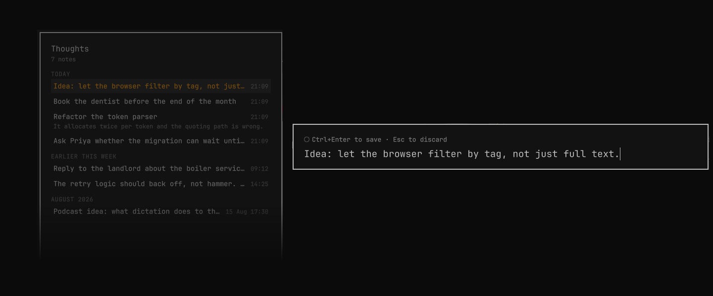

# Omathought

Hold a key, say the thing, let go. The thought is a file before you have
finished deciding whether it was worth keeping.

An Omarchy shell plugin that turns [Voxtype](https://voxtype.io/) push-to-talk
into a note library: a capture card at the bottom of the screen while you speak,
and a browser down the left-hand side for everything you have said so far.



## What it does

**Capture** — hold `F10`. A card appears at the bottom of the screen and
recording starts. Let go and Voxtype transcribes into the card, where the text
sits as an ordinary editable field until you decide:

- `Ctrl+Enter` saves it as a note
- `Esc` throws it away

Nothing is written until you confirm, so a misfire costs one keystroke. The
transcript is editable before saving — fixing a mangled word does not mean
re-recording the sentence.

**Browse** — press `Super+Shift+V`. A panel opens on the left with every note,
newest first, grouped under Today / Yesterday / Earlier this week / by month.

| Key | |
|---|---|
| `↑` `↓` | move between notes |
| `Enter` | edit the selected note |
| `Delete` | delete — press twice, the first press arms it |
| any letter | filter; every term must match |
| `Esc` | clear the filter, then close |

In the editor, `Ctrl+Enter` saves and `Esc` cancels. Editing keeps the note's
original creation time.

## Notes on disk

One Markdown file per note in `~/Documents/Thoughts`, named for the moment it
was captured:

```markdown
---
created: 2026-09-07T14:29:58+02:00
---

This is the end to end test of the capture card.
```

Plain files in a plain folder, so Obsidian, `grep`, `nvim` and a sync client all
work on them without knowing this plugin exists. Writes are atomic — a reader
never catches a half-written note.

To keep them somewhere else, point `notesDir` at another folder:

```sh
mkdir -p ~/.local/state/omarchy/settings
echo '{"notesDir": "~/Documents/Notes/voice"}' > ~/.local/state/omarchy/settings/omathought.json
```

## Requirements

- Omarchy 4 (Quattro), manifest schema 1
- A running [Voxtype](https://voxtype.io/) daemon with a working output chain —
  check with `voxtype setup check`
- `jq`, present in a normal Omarchy install

Voxtype's own `F9` cursor dictation is untouched; Omathought only adds `F10`.

## Install

```sh
omarchy plugin add https://github.com/marvreichmann/omathought.git --enable
```

Then add the keybindings to `~/.config/hypr/bindings.lua`:

```lua
o.bind("F10", "Capture a thought", "omarchy-shell -q omathought captureStart")
o.bind("F10", "Capture a thought (release)", "omarchy-shell -q omathought captureStop", { release = true })
o.bind("SUPER + SHIFT + V", "Browse thoughts", "omarchy-shell -q omathought toggleBrowse")
```

Check the keys are free on your system before binding them —
`omarchy menu keybindings --print`. `Super+V` is *not* free: it is Omarchy's
Universal paste.

The two `F10` lines are the whole push-to-talk mechanism. The second one, with
`release = true`, is what makes it hold-to-talk instead of a toggle; without it
recording never stops.

## Remove

```sh
omarchy plugin remove com.github.marvreichmann.omathought
```

Then delete the three `o.bind` lines from `~/.config/hypr/bindings.lua` and
reload with `hyprctl reload`. Removing the plugin does not unbind them, and a
binding left pointing at an absent plugin does nothing silently.

Your notes are left alone — Omathought never deletes the notes directory. To
remove them too:

```sh
rm -rf ~/Documents/Thoughts                          # or your own notesDir
rm -f ~/.local/state/omarchy/settings/omathought.json
```

Nothing else is touched: no packages are installed, no services registered, and
Voxtype's own configuration is never modified.

## How it works

Voxtype types its transcript into whatever holds keyboard focus. The capture
card is a layer surface that takes keyboard focus exclusively, so the transcript
lands in its text field as ordinary keystrokes — which is also why it is
editable the moment it arrives, and why nothing had to be reconfigured in
Voxtype to redirect its output.

The plugin is one `keepLoaded` overlay hosting both surfaces. `keepLoaded`
is load-bearing rather than an optimization: the key-release binding calls into
the plugin, and only a plugin the shell has already mounted can be called.

## Terminal use

The helper the plugin drives is usable on its own:

```sh
bin/omathought list                    # every note as JSON
bin/omathought save "a thought"        # write one, print its id
bin/omathought body <id>               # print one note
bin/omathought delete <id>
```

## License

MIT — see [LICENSE](LICENSE).
